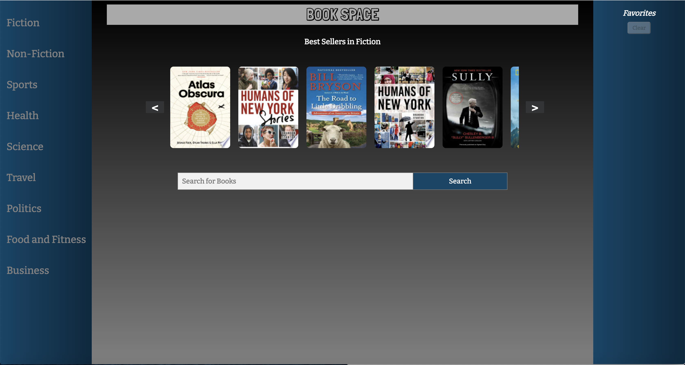
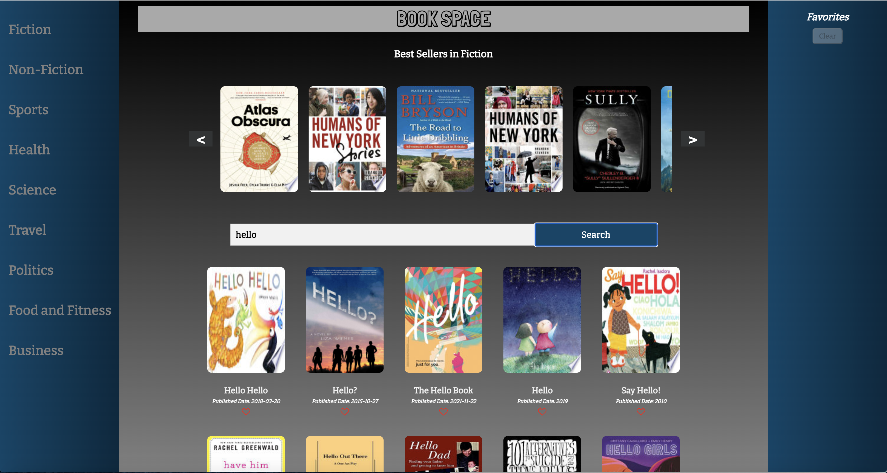
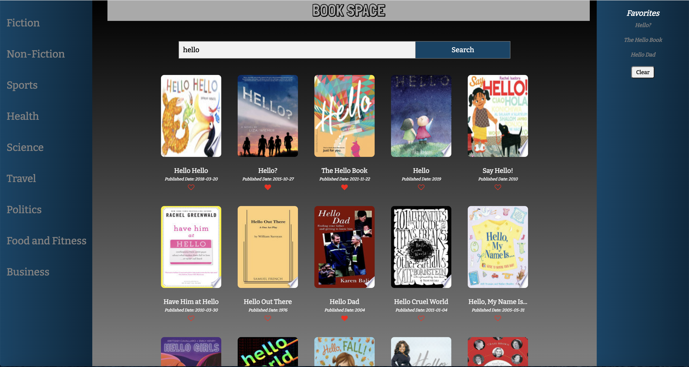

# BOOK SPACE

### Technologies: 

- Html
- Css
- JavaScript
- jQuery

### API:

NewYorkTimes API
  - Best Seller List

GoogleBooks API
  - Volumes

### Features:
  - Displays best seller books for various categories in the top carousel
  - Search for books by book title
  - Display book description in tool tip while hovering over the book cover image 
  - Clicking on Book Title will take the user to its google books page
  - Add and manage favorite list of books in local storage
  - Has a Sticky Header

### Screenshots:

##### Landing Page

##### Search

##### Adding Favorites 

##### Sticky Navigation

### Stretch Goals/Future Goals: 
  - Provison to search by author name
  - Add pagination to go through multiple pages
  - Provision to add books to the favorites list from the best seller carousel

